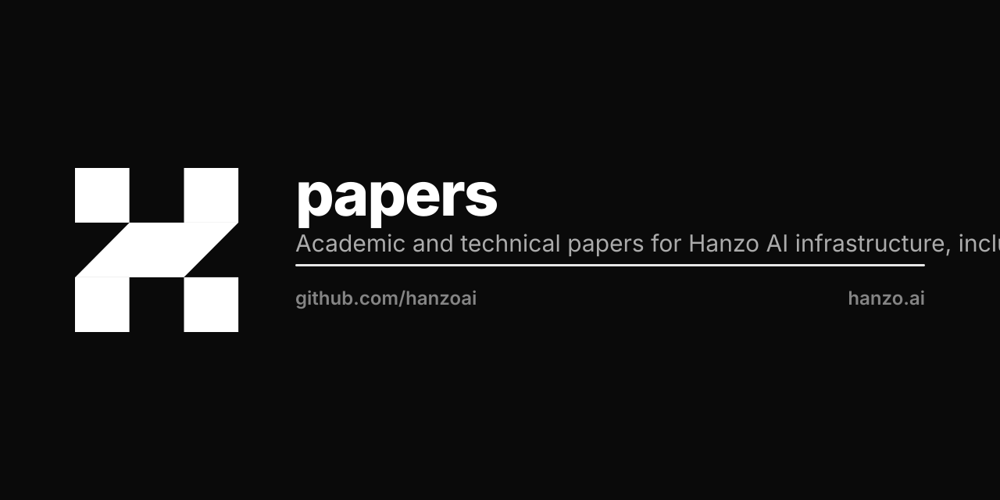

<p align="center"></p>

# Hanzo AI Research Papers

Technical papers covering Hanzo AI compute infrastructure, agent frameworks, ML inference, platform services, and defense applications. Includes the Zen model family co-developed with Zoo Labs Foundation.

## About

Hanzo AI is an American-owned, Techstars-backed ('17) applied AI lab, founded 2014,
building the **Zen** frontier model family alongside a vertically integrated,
post-quantum AI and cryptography stack. The work spans frontier models, an agentic
runtime, edge inference, and production post-quantum cryptography — engineered to run
sovereign and disconnected in defense, regulated, and air-gapped environments rather
than on centralized cloud.

## 2026 Highlights

Each claim below is developed in the catalogued papers ([INDEX.md](INDEX.md)):

- **Defense & Reindustrialization suite (16 papers + one-pager).** Positioned for the
  American industrial base — sovereign AI, robotics, post-quantum, and low-latency
  on-chain coordination for factories, vehicles, drones, ships, and contested-edge
  systems. **Strategy & case studies:** sovereign-vs-closed AI (`hanzo-vs-claude`), the
  ~90% cloud-cost migration on real numbers (`hanzo-cloud-economics`), agentic
  engineering at regulated scale (`hanzo-agentic-prowess`), FHE-native confidential
  computing (`hanzo-fhe-native`), automated security auditing (`hanzo-security`), and
  audit-ready compliance (`hanzo-compliance`). **Capability depth:** autonomous agentic
  AI (`hanzo-agentic-ai`), DDIL/tactical assured networking (`hanzo-assured-networking`),
  FHE-mediated cross-domain MLS (`hanzo-cross-domain`), edge AI/ML (`hanzo-edge-ai-ml`),
  counter-exploitation (`hanzo-countermeasures`), full-spectrum cyber
  (`hanzo-full-spectrum-cyber`), quantum sensing/QKD (`hanzo-quantum-sensing-qkd`),
  verification & validation (`hanzo-test-evaluation`), and the ZAP protocol
  (`hanzo-zap-protocol`). Start with the one-pager (`defense/hanzo-overview.pdf`); the
  full suite is published at **[papers.hanzo.ai](https://papers.hanzo.ai)**.
- **Engine / AI infrastructure (6 papers, measured on-device).** A native Rust
  train-and-serve engine benchmarked on real silicon: ROCm decode parity with llama.cpp
  at 97% of the memory-bandwidth wall (`hanzo-rocm-inference`), measured AMD/NVIDIA/Apple
  edge inference (`hanzo-cross-backend-inference`), native training inside the inference
  stack (`hanzo-native-training`), continuously-learning private AI
  (`hanzo-continuous-learning-privacy`), serving economics (`hanzo-platform-infra-desktop`),
  and the unifying thesis (`hanzo-native-stack-thesis`). Unusually honest — they name their
  own stubs and reverted kernels and claim no win over NVIDIA.
- **Production post-quantum cryptography.** All three NIST PQC standards — FIPS 203
  (ML-KEM), 204 (ML-DSA), 205 (SLH-DSA) — integrated into a live consensus system with
  hybrid classical/post-quantum security (`hanzo-full-spectrum-cyber`).
- **Formal verification.** 50 machine-checked Lean 4 proofs, 18 cryptographic security
  reductions (incl. ML-DSA EU-CMA, ML-KEM IND-CCA2), and NIST Known-Answer-Test
  validation across FIPS 203/204/205 (`hanzo-formal-verification`).
- **ZAP (Zero-copy Application Protocol).** 2.2 ns parse latency, 11.5M transactions/s,
  91% memory and 96% energy reduction vs JSON-RPC; native post-quantum transport
  (ML-KEM-768 + ML-DSA-65) and W3C DID identity (`hanzo-zap-protocol`).
- **Agentic runtime.** 83 specialized agents and 15 orchestrators executing 200–300
  sequential tool calls, fully offline on embedded ARM with quantized Zen models
  (`hanzo-agentic-ai`, `hanzo-edge-ai-ml`).
- **Zen frontier models.** An 18-model family (0.8B–1T+ parameters), co-developed with
  Zoo Labs Foundation, with owned weights and full provenance.

## Structure

Each paper lives in its own subdirectory:
```
papers/
├── shared/             # cover styles, lstlang.tex, paperkit
│   ├── hanzocover.sty
│   └── lstlang.tex
├── <paper-slug>/
│   ├── <paper-slug>.tex          # main file (\input's sections)
│   ├── <paper-slug>.pdf          # compiled output
│   └── sections/                 # modular sections
│       ├── 01-intro.tex
│       ├── 02-architecture.tex
│       ├── 03-protocol.tex
│       ├── ...
│       └── 99-bibliography.tex
└── INDEX.md                      # auto-generated catalogue
```

## Building

```bash
cd <paper-slug>
TEXINPUTS=".:..:" latexmk -pdf <paper-slug>.tex
```

Or build all:
```bash
make all
```

## Index

See [INDEX.md](INDEX.md) for full catalogue of papers.

## Conventions

1. **One paper, one directory**. No top-level .tex files.
2. **Modular sections**. Main .tex \input's `sections/NN-name.tex` files for easy editing.
3. **Shared cover**. All papers use `\usepackage{shared/hanzocover}` and `\hanzocoverpage`.
4. **Shared lstlang**. All papers use `\input{shared/lstlang}` after `\usepackage{listings}`.
5. **No AI slop**. Technical, dense, citation-supported.
6. **One paper per concept**. Updates over time via versioning, not duplication.
